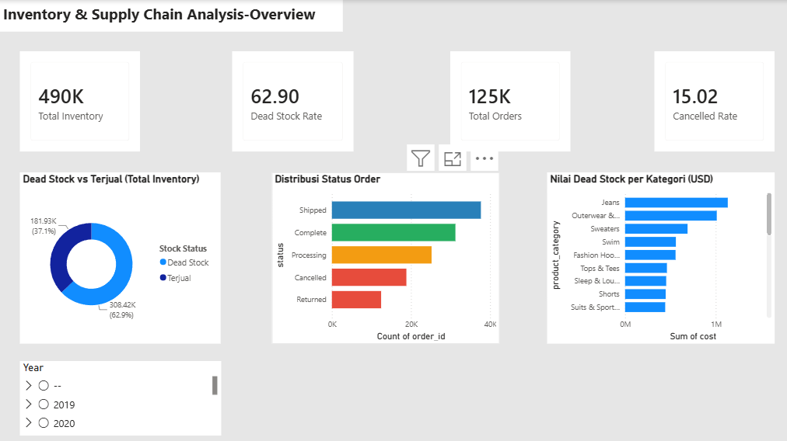

# Inventory & Supply Chain Analysis

## Project Overview
End-to-end analysis of inventory and supply chain data using Google BigQuery, PostgreSQL, Python, and Power BI. Project ini mengidentifikasi masalah sistemik pada manajemen stok dan memberikan rekomendasi actionable berbasis data.

## Key Findings
- **Dead Stock 62.9%** — 308.422 dari 490.356 item belum terjual, merata di semua 26 kategori dan 10 gudang
- **24.9% Order Tidak Selesai** — 15% Cancelled + 9.9% Returned
- **Avg Lead Time 3.9 hari** — masih dalam range normal
- **Timestamp Anomaly 19.6%** — indikasi masalah integrasi sistem warehouse
- **Avg Margin 50.8%** — margin sehat tapi terkunci di dead stock

## Tools & Tech Stack
- **Google BigQuery** — eksplorasi dataset publik thelook_ecommerce
- **PostgreSQL** — penyimpanan data lokal
- **Python** (Pandas, Matplotlib, Seaborn) — data cleaning & EDA
- **Power BI** — dashboard interaktif 3 halaman

## Project Structure

```
├── 01_bigquery_exploration.md
├── 02_cleaned_data_inv_sply_chn.ipynb
├── 02_cleaning_documentation.md
├── 02_postgres_add_tables.ipynb
├── 03_EDA.ipynb
├── 03_EDA_2.ipynb
├── 03_EDA_key_findings.png
├── 04_PBI_Overview.png
├── 04_PBI_Problem Analysis.png
└── 04_PBI_Rekomendasi & Action Items.png
```

## Dashboard Preview

### Overview


### Problem Analysis


### Recommendations


## Dataset
- **Source:** Google BigQuery Public Dataset — `bigquery-public-data.thelook_ecommerce`
- **Note:** Dataset sintetis yang dirancang Google untuk keperluan pembelajaran. Temuan mencerminkan kemampuan analisis, bukan kondisi bisnis nyata.
